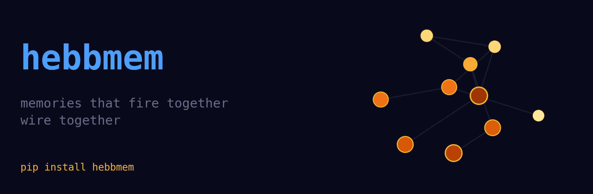
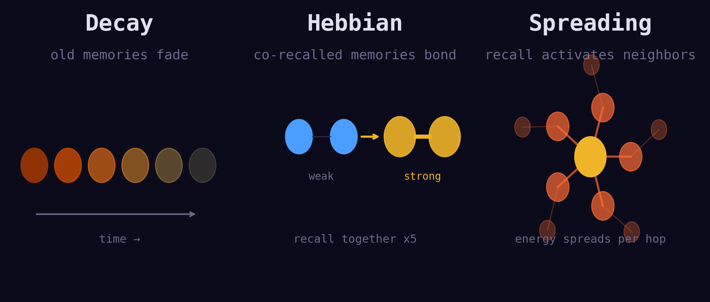
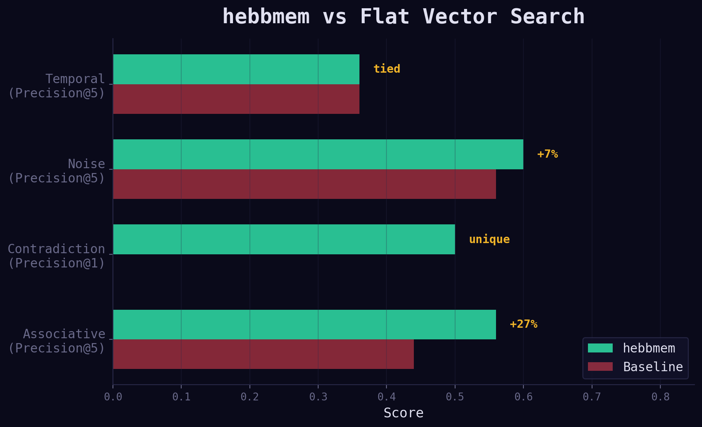

<p align="center">
  
</p>

# hebbmem

Hebbian memory for AI agents — memories that fire together wire together.

## Install

```bash
pip install hebbmem
```

For higher-quality semantic embeddings:

```bash
pip install hebbmem[ml]
```

## Quick Start

```python
from hebbmem import HebbMem

mem = HebbMem()

# Store memories
mem.store("Python is great for data science", importance=0.8)
mem.store("JavaScript runs in the browser", importance=0.5)
mem.store("Neural networks learn from data", importance=0.7)

# Time passes, memories decay
mem.step(5)

# Recall activates related memories through the graph
results = mem.recall("machine learning with Python", top_k=3)
for r in results:
    print(f"{r.content} (score={r.score:.3f})")
```

## How It Works

hebbmem replaces flat vector storage with three neuroscience mechanisms:

<p align="center">
  
</p>

**Decay** — Memories fade over time unless reinforced, following the Ebbinghaus forgetting curve. Recent and frequently accessed memories stay strong.

**Hebbian Learning** — Memories recalled together strengthen their connections. "Neurons that fire together wire together." Over time, the graph learns which memories are related through usage, not just embedding similarity.

**Spreading Activation** — Recalling one memory activates related ones through the graph, surfacing connections that keyword or vector search alone would miss.

## Persistence

Save and restore memory state across sessions:

```python
mem.save("agent_memory.hebb")

# Later...
mem = HebbMem.load("agent_memory.hebb", encoder="hash")
```

Uses SQLite internally — single file, zero dependencies, crash-safe.

## Configuration

```python
from hebbmem import HebbMem, Config

config = Config(
    activation_decay=0.9,    # how fast activation fades (0-1)
    strength_decay=0.999,    # how fast long-term strength fades (0-1)
    hebbian_lr=0.2,          # learning rate for co-activation (0-1)
    spread_factor=0.5,       # energy spread per hop (0-1)
    max_hops=3,              # BFS depth for spreading activation
    scoring_weights={        # recall ranking formula
        "activation": 0.4,
        "similarity": 0.35,
        "strength": 0.15,
        "importance": 0.1,
    },
)
mem = HebbMem(encoder="hash", config=config)
```

## Batch Store

```python
ids = mem.store_batch(
    ["memory one", "memory two", "memory three"],
    importances=[0.9, 0.5, 0.3],
)
```

## Thread Safety

All public methods are thread-safe (protected by `threading.RLock`). Safe to use from multiple threads in agent frameworks.

## Logging

hebbmem uses stdlib `logging`. Enable debug output:

```python
import logging
logging.basicConfig(level=logging.DEBUG)
```

## Benchmark

<p align="center">
  
</p>

hebbmem outperforms flat vector search (pure cosine similarity) on key scenarios:

| Scenario | Metric | hebbmem | Baseline | Delta |
|----------|--------|---------|----------|-------|
| Associative | Precision@5 | 0.56 | 0.44 | +27.3% |
| Associative | Assoc. Hit Rate | 0.13 | 0.00 | — |
| Noise | Precision@5 | 0.60 | 0.56 | +7.1% |
| Contradiction | Precision@1 | 0.50 | 0.00 | — |
| Contradiction | MRR | 0.75 | 0.50 | +50.0% |
| Temporal | Precision@5 | 0.36 | 0.36 | tied |

Key wins: **contradiction handling** (50% MRR improvement — newer memories rank higher) and **associative recall** (finds indirectly connected memories that baseline misses entirely). Results use HashEncoder; advantages are larger with semantic embeddings.

Run yourself: `uv run python benchmarks/run_benchmark.py` — see [`benchmarks/`](benchmarks/README.md) for methodology.

## Visualization

Interactive D3.js demo showing spreading activation, Hebbian reinforcement, and decay in real-time. Dark theme with glowing nodes — neurons firing.

```bash
uv pip install fastapi uvicorn
uv run python demo/server.py
# Open http://localhost:8765
```

See [`demo/`](demo/README.md) for walkthrough.

## Examples

See [`examples/`](examples/) for runnable scripts:

- [`basic_usage.py`](examples/basic_usage.py) — store, decay, recall, forget
- [`agent_integration.py`](examples/agent_integration.py) — using hebbmem as an agent's memory backend
- [`custom_config.py`](examples/custom_config.py) — tuning decay, Hebbian learning, and scoring weights

## Integrations

hebbmem works with any agent framework. See [examples/integrations/](examples/integrations/) for runnable demos:

- **Ollama** — Local chatbot with persistent memory, no API keys
- **LangChain** — Drop-in replacement for ConversationBufferMemory
- **OpenAI** — Persistent memory layer for stateless GPT calls
- **CrewAI** — Shared memory between multiple agents
- **smolagents** — HuggingFace lightweight agent with memory tools

The integration pattern is always the same:

```python
mem = HebbMem()
mem.store(user_input)
context = mem.recall(query)
mem.step()
```

## Links

- [GitHub](https://github.com/codepawl/hebbmem)
- [Changelog](CHANGELOG.md)
- [Codepawl](https://github.com/codepawl)
